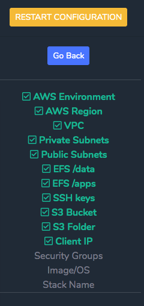

= Web-Based Installer for SOCA
:toc:

== What is SOCA?

Refer to link:https://awslabs.github.io/scale-out-computing-on-aws/[https://awslabs.github.io/scale-out-computing-on-aws/] if you are not familiar with SOCA.

== Requirements

You will need `python3` (python2 is not supported) as well as `flask`, `ipaddress` and  `boto3`. Run `pip install -r requirements.txt` to install all required dependencies:

You also need `awscli` link:https://aws.amazon.com/cli/[configured] on your machine. My code does not change/create any AWS resources on your behalf. The only required IAM policies are `Describe` and `List`.

== How it works?

Clone the repo
```bash
git clone git@github.com:<YOUR_GITHUB_USER>/soca-web-based-installer.git
```

Execute `python3 main.py`, this will launch a new web portal available at `http://127.0.0.1:5000`. You can change the listener address/port if needed by updating `main.py`

```python
python3 soca-web-based-installer/main.py

=============================================
Access the installer using http://127.0.0.1:5000
=============================================
```

Access `https://127.0.0.1:5000` using your favorite browser and follow the instructions.

image::imgs/wizard_3.png[]

Once you are done, the installer will generate a link for CloudFormation.


Click on the link and your CloudFormation template will be pre-filled with the parameters you just have selected


You will only have to specify an LDAP user/password and click "Create" to launch SOCA installation.


== Features

=== Support Base or Advanced install

Choose whether you want to let SOCA build your AWS backend environment (VPC, subnets, security groups, EIP ...) or import SOCA in your existing environment


=== Save your progress

You can check your current progress by looking at the left sidebar



=== Configuration Validation

The installation wizard look for your AWS environment configuration and will prevent SOCA to be deployed if your backend is not configured correctly. This includes security group checks, subnet validation and general settings.

image::imgs/wizard_2.png[]

=== Resource Discovery

This service use `boto3` to retrieve your AWS resources in real-time.

image::imgs/wizard_4.png[]

=== IAM Permissions

My code only performs ReadOnly operations (see `src/client_aws.py`). These permissions are needed to generate the installation parameters. You will need another IAM user with admin privileges to perform the actual installation.

==== For a Standard Install:

```json

{
    "Version": "2012-10-17",
    "Statement": [
        {
            "Sid": "WebBasedSOCAPermissions",
            "Effect": "Allow",
            "Action": [
                "s3:ListAllMyBuckets",
                "s3:ListBucket",
                "ec2:DescribeKeyPairs"
            ],
            "Resource": "*"
        }
    ]
}
```

====  For an Advanced Install:
```json
{
    "Version": "2012-10-17",
    "Statement": [
        {
            "Sid": "WebBasedSOCAAdvancedPermissions1",
            "Effect": "Allow",
            "Action": [
                "s3:ListAllMyBuckets",
                "s3:ListBucket",
                "ec2:DescribeVpcs",
                "ec2:DescribeSubnets",
                "ec2:DescribeKeyPairs",
                "ec2:DescribeSecurityGroups",
                "ec2:DescribeNetworkInterfaceAttribute"
            ],
            "Resource": "*"
        },
        {
            "Sid": "WebBasedSOCAAdvancedPermissions2",
            "Effect": "Allow",
            "Action": [
                "elasticfilesystem:DescribeMountTargets",
                "elasticfilesystem:DescribeFileSystems",
                "elasticfilesystem:DescribeMountTargetSecurityGroups"
            ],
            "Resource": "arn:aws:elasticfilesystem:*:*:file-system/*"
        }
    ]
}
```

=== FAQ


You do not have configured `awscli` or your `$HOME/.aws/credentials` is malformed. Run `aws configure` or read the AWS CLI instructions[https://docs.aws.amazon.com/cli/latest/userguide/cli-chap-configure.html]


For High Availability purpose, your 3 public/private subnets must use different availability zones.

image::imgs/error_2.png[]

Your security groups are invalid. Follow the instructions to fix the configuration for both Scheduler and Compute Nodes security groups. 


