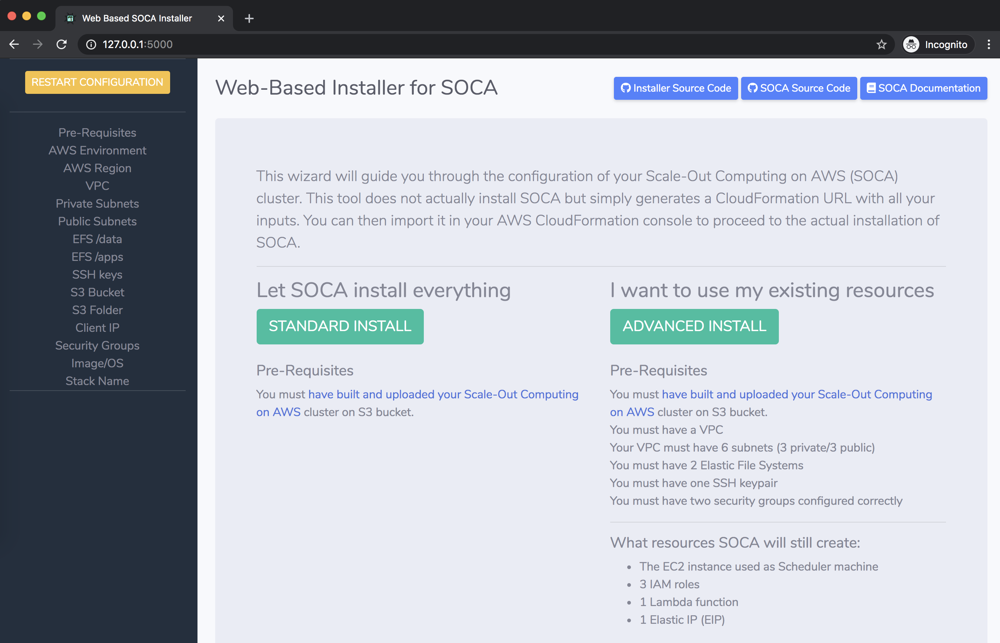
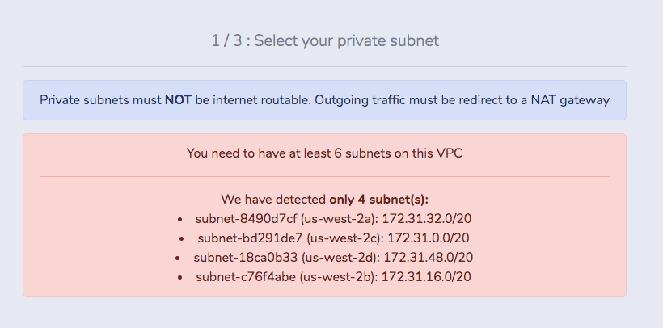
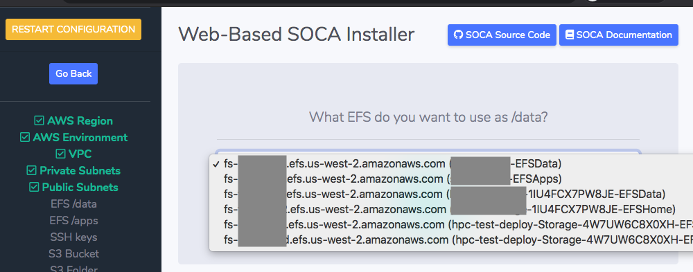
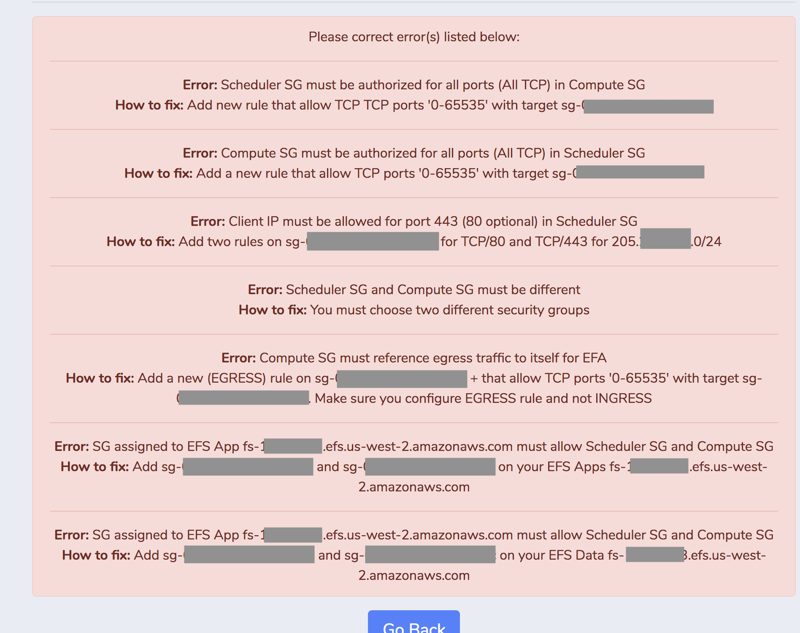

# Integrate SOCA with your existing AWS resources
By default, [Scale-Out Computing on AWS](https://github.com/awslabs/scale-out-computing-on-aws) creates an HPC environment on AWS and automatically deploy backend services such as VPC, Subnets, NAT Gateways, Filesystem etc ...

However, you may want to integrate your SOCA cluster with your existing resources. If that's the case, you will need to manually specify a lot of parameters. To minimize human errors and misconfiguration, I have developed a simple web UI (running on your local system) which retrieve your AWS environment(s) and generate the SOCA installation automatically.

## What is SOCA?

Refer to [https://awslabs.github.io/scale-out-computing-on-aws/](https://awslabs.github.io/scale-out-computing-on-aws/) if you are not familiar with SOCA.

## Requirements

You will need `python3` (python2 is not supported) as well as `flask`, `ipaddress` and  `boto3`. Run `pip install -r requirements.txt` to install all required dependencies:

You also need `awscli` [configured](https://aws.amazon.com/cli/) on your machine. My code does not change/create any AWS resources on your behalf. The only required IAM policies are `Describe` and `List`.

## How it works?

Clone the repo
```bash
git clone git@github.com:<YOUR_GITHUB_USER>/soca-web-based-installer.git
```

Execute `main.py`, this will launch a new web portal available at `http://127.0.0.1:5000`. You can change the listener address/port if needed by updating `main.py`

```python
python3 soca-web-based-installer/main.py

=============================================
Access the installer using http://127.0.0.1:5000
=============================================
```

Access `https://127.0.0.1:5000` using your favorite browser and follow the instructions.



Once you are done, the installer will generate a link for CloudFormation.


Click on the link and your CloudFormation template will be pre-filled with the parameters you just have selected


You will know only have to specify an LDAP user/password and click "Create" to launch SOCA installation.


## Features

### Save your progress

You can check your current progress by looking at the left sidebar


### Error Management

The installation wizard look for your AWS environment configuration and will prevent SOCA to be deployed if your backend is not configured correctly. This includes security group checks, subnet validation and general settings.



### Resource Discovery

This service use `boto3` to retrieve your AWS resources in real-time. My code only performs ReadOnly operations (see `src/client_aws.py`)



### FAQ


You do not have configured `awscli` or your `$HOME/.aws/credentials` is malformed. Run `aws configure` or read the [AWS CLI instructions](https://docs.aws.amazon.com/cli/latest/userguide/cli-chap-configure.html)


For High Availability purpose, your 3 public/private subnets must use different availability zones.



Your security groups are invalid. Follow the instructions to fix the configuration for both Scheduler and Compute Nodes security groups. 


